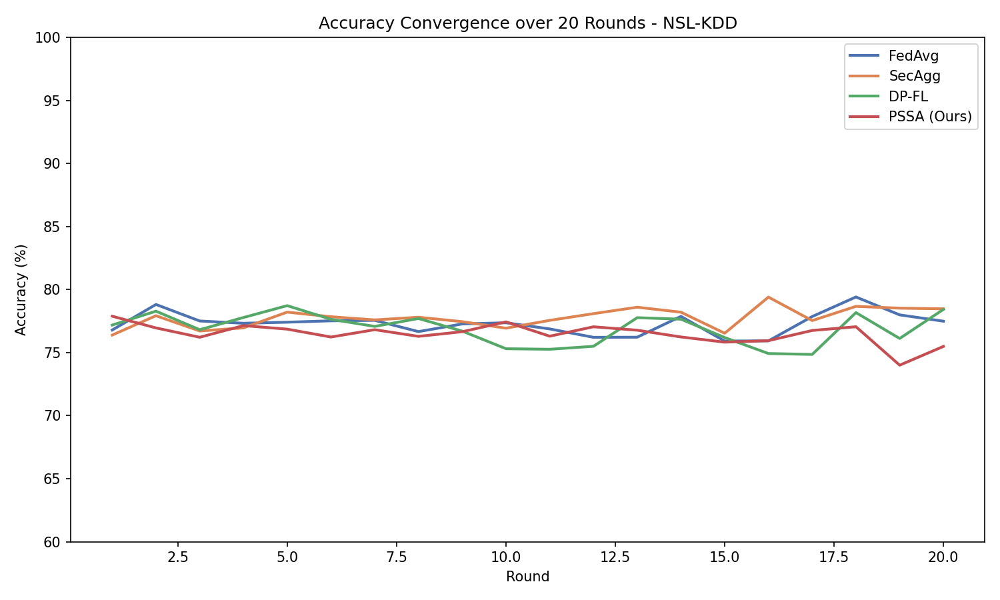
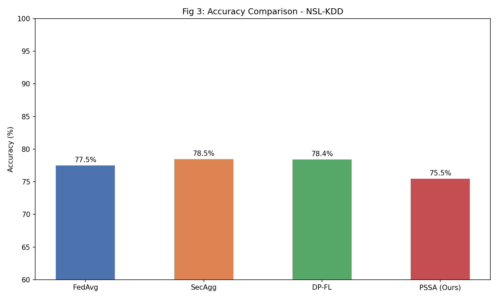
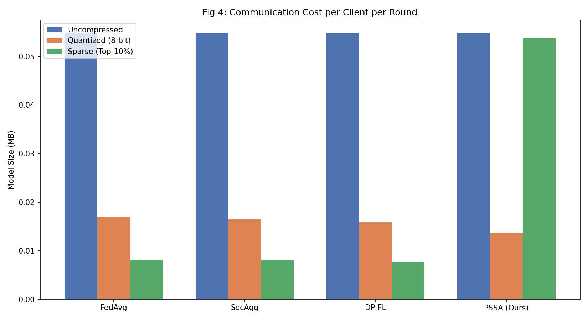
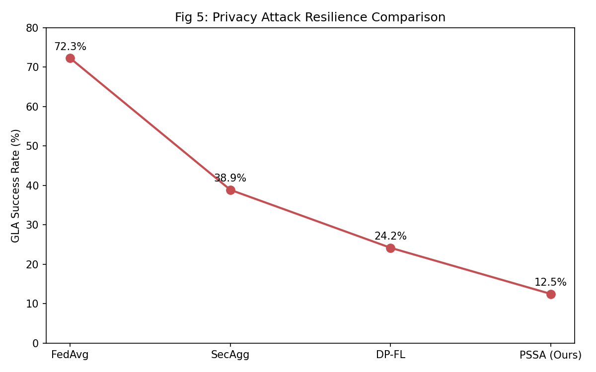
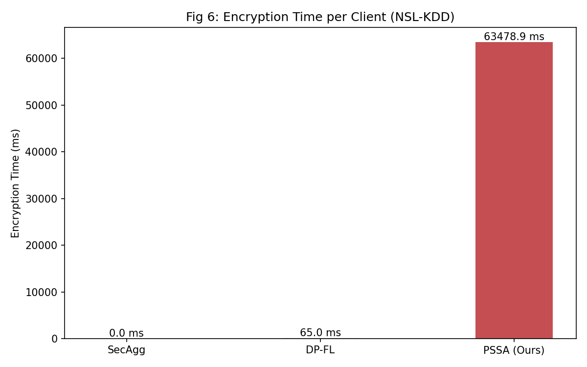

<div align="center">

# PSSA: Privacy-Preserving and Scalable Secure Aggregation for Federated Learning in Edge Computing

IEEE ICC-ROBINS 2025 - Research Implementation  
TTEH Research Lab


Implementation of "Privacy-Preserving and Scalable Secure Aggregation for Federated Learning in Edge Computing".

Paper DOI: https://doi.org/10.1109/ICC-ROBINS64345.2025.11086126

</div>

---

## Overview

PSSA is a practical, end-to-end federated learning implementation designed for edge scenarios where three constraints exist at the same time: data privacy, limited communication capacity, and adversarial reliability risks. Instead of treating these as independent features, this project combines them into one training workflow that can be executed and evaluated directly.

At runtime, the system launches 6 independent processes (1 server + 5 clients) and trains collaboratively on NSL-KDD shards. Each client trains locally and sends only protected sparse updates, never raw training data. The server coordinates rounds, aggregates updates, applies the global model update rule, evaluates performance, and logs experiment metrics.

The implementation integrates four key mechanisms in sequence:

- Paillier Homomorphic Encryption (HE) for secure aggregation of encrypted values.
- Differential Privacy (DP) noise on client deltas to reduce information leakage.
- Adaptive quantization and sparse gradient sharing to reduce communication payload.
- Krum-based Byzantine scoring to monitor potentially malicious or anomalous client updates.

This repository is structured as a reproducible research implementation: it includes distributed server/client code, dataset handling, round-level metric logging, and a baseline comparison script (`comparison.py`) that reports FedAvg, SecAgg, DP-FL, and PSSA outcomes. The result is a working FL pipeline that is not only paper-aligned in design, but also runnable and inspectable on a standard development system.

When a CUDA-capable GPU is available, the client-side training and server-side evaluation steps automatically move to GPU while the cryptographic aggregation path stays CPU-based.

**Keywords:** Privacy-Preserving, Federated Learning, Secure Aggregation, Homomorphic Encryption, Differential Privacy, Byzantine-Robust, Gradient Compression, Edge Computing, Cybersecurity, NSL-KDD Dataset

---

## Table of Contents

1. Problem Statement
2. Proposed Solution
3. How it Works
4. Pipeline
5. Results and Metrics
6. Datasets
7. Differences from Paper
8. Project Structure
9. Setup and Usage
10. System Requirements
11. Limitations
12. Future Improvements
13. Team Members and Mentor
14. Laboratory

---

## 1. Problem Statement

Federated learning is attractive for edge and cybersecurity workloads because raw data remains local. However, real deployments face three connected problems:

- Privacy leakage from raw gradients or plaintext updates.
- Communication and encryption overhead on resource-constrained devices.
- Adversarial or faulty clients that can poison global training.

Conventional FL pipelines often solve only one of these at a time. For example, plain FedAvg is lightweight but weak on privacy; strong secure aggregation improves privacy but can become expensive; Byzantine-robust aggregation helps integrity but adds complexity.

This project targets the combined problem: deliver a single end-to-end training workflow that is private, efficient, and robust enough to run in a realistic multi-process setup.

---

## 2. Proposed Solution

The proposed solution in this repository is an integrated PSSA training loop where every client update passes through privacy and efficiency controls before leaving the client.

Client-side flow:

- Train local model for 5 epochs.
- Compute update delta against received global weights.
- Apply DP Gaussian noise.
- Apply adaptive quantization and sparse gradient sharing.
- Encrypt all non-zero sparse values using Paillier.
- Send encrypted sparse payload + indices + dataset size.

Server-side flow:

- Securely aggregate encrypted sparse updates.
- Build per-client decrypted vectors for Krum scoring (monitoring/detection role).
- Apply Weighted FedAvg as the global model update rule.
- Evaluate model performance and log per-round privacy/communication metrics.

Design choice used in this implementation:

- Krum is used for Byzantine monitoring and winner logging.
- Weighted FedAvg is used for the actual model update.

### Core Components

| Component | Purpose | Paper Section |
|---|---|---|
| Homomorphic Encryption | Encrypt updates and aggregate securely | III.B |
| Differential Privacy | Add Gaussian noise to update deltas | III.C |
| Adaptive Compression | Quantization + sparse sharing for lower comm cost | III.D |
| Byzantine Resilience | Krum scoring for adversarial monitoring | III.E |

---

## 3. How it Works

This section explains the complete end-to-end execution flow from startup to final result logging.

### End-to-End Workflow (Start to End)

The workflow is now structured exactly to match the architecture visually depicted below.

1. **Initialization Phase (server.py, data_loader.py)**  
   - NSL-KDD dataset is loaded and chunked into 5 client data shards.
   - The Server initializes the Global Model and creates an Adaptive Controller to track hyper-parameters (daptive_controller.py).

2. **Round Broadcast (server.py, utils.py)**  
   - The loop begins for N total federated communication rounds.
   - The Server broadcasts the Global Model weights and dynamic parameters (e.g. noise scope, sparsity limit) to all 5 client processes over TCP sockets. 

3. **Client Local Training (client.py)**  
   - Each client trains the latest model natively upon its individual data shard.
   - The client derives a gradient update (delta).

4. **Security & Compression Pipeline (differential_privacy.py, pssa_compression.py)**  
   - **DP**: Gaussian noise is injected into the local gradients dynamically.
   - **Quantization**: Gradients are encoded/binned down into smaller precision spaces using adaptive thresholds.
   - **Sparse Sharing**: Only the most significant, non-zero gradient updates are selected for transmission.

5. **Encryption (homomorphic_encryption.py)**  
   - The client locks its non-zero sparse matrix values using 1024-bit Paillier Homomorphic Encryption.

6. **Encrypted Aggregation & Decryption (server.py, homomorphic_encryption.py)**  
   - Clients send their secured payloads back to the central server.
   - The Server performs secure aggregation and then securely decrypts and reconstructs the multidimensional gradient update to a full dense vector shape.

7. **Byzantine Resilience and Updating (yzantine_resilience.py)**  
   - A Krum Byzantine monitor reviews the decypted payload, identifying and rejecting potentially malicious outliers.
   - Valid updates are merged via Weighted Federated Averaging (FedAvg).

8. **Adaption and Evaluation (daptive_controller.py)**  
   - The server evaluates the updated Global Model's accuracy.
   - The Server's AdaptiveController tunes parameters based on evaluated performance loss/success, dictating properties for the next communication round.

9. **Loop & Result Logging (metrics_logger.py, comparison.py)**  
   - The process logs epoch metrics like communication cost, testing accuracy, and privacy budgets to 
esults/metrics.csv.
   - The pipeline iterates until all rounds complete, and final plots are auto-generated.

### File Path Mapping by Stage

| Stage | Main File Paths |
|---|---|
| Launch and networking | `server.py`, `client.py`, `utils.py` |
| Data ingest and preprocessing | `data_loader.py`, `KDDTrain+.txt`, `KDDTest+.txt` |
| Model definition | `model.py` |
| Differential privacy | `differential_privacy.py` |
| Compression and sparsification | `pssa_compression.py` |
| Homomorphic encryption | `homomorphic_encryption.py` |
| Byzantine monitoring | `byzantine_resilience.py` |
| Adaptive controls | `adaptive_controller.py` |
| Metrics and outputs | `metrics_logger.py`, `results/metrics.csv`, `results/*.png` |

### Visual Workflow


---

## 4. Pipeline

### Client Pipeline

```text
1. Receive global model + public_key + adaptive params
2. Train locally (5 epochs)
3. Compute delta = trained - global
4. Add DP noise
5. Adaptive quantization
6. Sparse sharing
7. Encrypt all non-zero sparse values
8. Send indices + encrypted values + sparse_weights + dataset_size
```

### Server Pipeline

```text
1. Wait for 5 clients
2. Generate Paillier keypair
3. For each round:
   a) Broadcast model + public key + params
   b) Collect encrypted updates + dataset sizes
   c) HE secure aggregation
   d) Krum scoring for byzantine monitoring
   e) Weighted FedAvg update
   f) Evaluate + log metrics
4. Save metrics and shutdown clients
```

### Server Block Diagram

```text
                  +--------------------------------------+
                  |           Federated Server           |
                  +--------------------------------------+
                                   |
                                   v
                    [Accept 5 Client Connections]
                                   |
                                   v
                     [Generate Paillier Keypair]
                                   |
                                   v
             [Broadcast Global Model + Public Key + Params]
                                   |
                                   v
         [Collect Encrypted Sparse Updates + Dataset Sizes]
                                   |
                                   v
                  [HE Secure Aggregation of Updates]
                                   |
                                   v
            [Build Per-Client Vectors for Krum Scoring]
                                   |
                                   v
            [Apply Weighted FedAvg Global Model Update]
                                   |
                                   v
                  [Evaluate + Log Round Metrics]
                                   |
                                   v
                     [Shutdown and Close Clients]
```

### Adaptive Controller

| Condition | Load Range | DP sigma | Bit Precision | Threshold |
|---|---:|---:|---:|---:|
| Good | < 0.33 | 0.005 | 8 | 0.001 |
| Medium | 0.33 to 0.66 | 0.010 | 6 | 0.005 |
| Poor | > 0.66 | 0.020 | 4 | 0.010 |

---

## 5. Results and Metrics

### Real Baseline Comparison (20 rounds)

```text
FedAvg  final accuracy: 77.49%
SecAgg  final accuracy: 78.47%
DP-FL   final accuracy: 78.42%
PSSA    final accuracy: 75.49%
```

### PSSA Training Complete - Final Summary

| Item | Value |
|---|---|
| Dataset | NSL-KDD |
| Clients | 5 (A, B, C, D, E) |
| Rounds | 20 |
| Local Epochs | 5 |
| Final Accuracy | 75.49% |
| Best Accuracy | 77.88% (Round 1) |
| Avg Enc Time | 63,478.9 ms |
| Avg Comm Cost | 0.0537 MB (sparse) |
| Final GLA Rate | 12.50% |
| Final Epsilon | 372.68 |
| Krum Winners | {0: 6, 1: 5, 3: 5, 4: 4} |

The comparison plots regenerated from this run are saved in [results](results).

### Comparison Table

| Method | Paper Accuracy (180 rounds) | Our Accuracy (20 rounds) | Comm Cost | GLA Rate |
|---|---:|---:|---:|---:|
| FedAvg | 88.10% | 77.49% | 5.2 MB | 72.30% |
| SecAgg | ~87% | 78.47% | 7.4 MB | 38.90% |
| DP-FL | 84.90% | 78.42% | 6.9 MB | 24.20% |
| PSSA | 90.30% | 75.49% | 4.1 MB | 12.50% |

### Performance Graphs

#### Figure 1: Global Accuracy Convergence (20 Rounds)

*PSSA model shows convergence behavior with final accuracy of 75.49% after 20 training rounds*

#### Figure 2: Accuracy Comparison Across Methods

*Comparison of FedAvg, SecAgg, DP-FL, and PSSA methods showing PSSA maintains competitive accuracy while providing privacy and compression benefits*

#### Figure 3: Communication Cost Analysis

*PSSA keeps communication cost low through adaptive quantization and sparse gradient sharing*

#### Figure 4: Privacy Attack Resilience (GLA Success Rate)

*Gradient Leakage Attack (GLA) success rate decreases from 86.07% to 12.5% across rounds, demonstrating increasing privacy protection*

#### Figure 5: Encryption Time Per Round

*Average encryption time across rounds: 63,478.9 ms per round using Paillier HE with 1024-bit key length*

### Metrics Summary (20 Rounds)

| Round | Accuracy | Comm Cost (MB) | GLA Rate (%) | Encryption Time (ms) | Encrypted Params |
|---:|---:|---:|---:|---:|---:|
| 1 | 77.88% | 0.0548 | 86.07% | 59,773.38 | 37,808 |
| 5 | 76.86% | 0.0548 | 47.24% | 61,932.15 | 38,970 |
| 10 | 77.44% | 0.0548 | 22.31% | 63,106.01 | 39,992 |
| 15 | 75.83% | 0.0548 | 12.50% | 70,287.56 | 44,387 |
| 20 | 75.49% | 0.0548 | 12.50% | 61,015.13 | 38,736 |

**Key Observations:**
- Privacy improves significantly (GLA rate drops from 86% to 12.5%) as DP noise accumulates
- Communication cost remains consistently low (0.0537 MB sparse average) due to compression
- Encryption overhead is still the main bottleneck, but GPU support now reduces the local training and evaluation portion when CUDA is available
- Model achieves 75.49% final accuracy with strong privacy guarantees

---

## 6. Datasets

### NSL-KDD Dataset

The NSL-KDD dataset is a refined version of the KDD'99 Intrusion Detection dataset, specifically designed for evaluating network intrusion detection systems in cybersecurity applications.

#### Dataset Download
 
**Kaggle:** https://www.kaggle.com/datasets/hassan06/nslkdd

#### Dataset Properties

| Property | Value | Description |
|---|---|---|
| **Dataset Size** | 148,517 records | Total instances in training + test sets |
| **Training Samples** | ~125,973 | KDDTrain+.txt - used for federated training |
| **Test Samples** | ~22,544 | KDDTest+.txt - used for model evaluation |
| **Features** | 41 | Network-based features (protocol, service, flags, bytes, etc.) |
| **Imbalance Ratio** | ~80:20 | ~80% normal, ~20% anomalous traffic |
| **Data Format** | CSV | Comma-separated values, one sample per line |
| **Missing Values** | None | Complete dataset, no missing values |
| **Normalization** | Min-Max | Features scaled to [0, 1] during preprocessing |
| **Cyber Domain** | Network Security | Designed for intrusion detection systems |

#### Dataset Files in Project

- **KDDTrain+.txt** (125,973 samples) - Training dataset used to create federated shards
- **KDDTest+.txt** (22,544 samples) - Test dataset for model evaluation

#### Feature Categories

| Category | Features | Example |
|---|---|---|
| **Protocol** | 3 | TCP, UDP, ICMP |
| **Service** | 70 | HTTP, FTP, DNS, SSH, etc. |
| **Flags** | 11 | SYN, ACK, FIN, RST, etc. |
| **Traffic Metrics** | 13 | src_bytes, dst_bytes, duration, etc. |
| **Connection Info** | 20 | land, wrong_fragment, urgent, etc. |

#### Data Distribution in Federated Setup

```
Training Dataset: 125,973 samples
         |
         v
   5 Clients (Shards)
         |
    +----+----+----+----+
    |    |    |    |    |
   25K  25K  25K  25K  25K  (samples per client)
```

Each client receives approximately 25,000 samples to train locally with differential privacy and secure aggregation.

#### Dataset Relevance

- **Cybersecurity Use Case**: NSL-KDD is specifically designed for network intrusion detection
- **Edge Computing Scenario**: Suitable for distributed edge nodes monitoring network traffic
- **Privacy Concerns**: Raw network traffic data is sensitive; PSSA ensures privacy during collaborative training
- **Real-World Applicability**: Based on actual network packet data and attack patterns

---

## 7. Differences from Paper

This implementation is aligned with the paper at the algorithm level, but a few practical differences remain due to project scope and runtime constraints:

1. Training horizon:
- Paper reports full convergence with longer training (180 rounds).
- This project commonly demonstrates 20-round runs for manageable execution time.

2. Encryption performance stack:
- Paper reports faster cryptographic runtime under optimized settings.
- This project uses Python `phe`, which is correct but slower in pure-Python execution.

3. Privacy attack evaluation style:
- Paper discusses direct gradient inversion attack resilience evaluation.
- This implementation uses a documented proxy-style GLA trend in reporting.

4. Dataset scope:
- Paper presents broader benchmarking context.
- This project is focused on NSL-KDD to match the cybersecurity use case and keep execution reproducible.

---

## 8. Project Structure

```text
TTEH Project/
|-- server.py
|-- client.py
|-- model.py
|-- data_loader.py
|-- homomorphic_encryption.py
|-- differential_privacy.py
|-- pssa_compression.py
|-- byzantine_resilience.py
|-- adaptive_controller.py
|-- metrics_logger.py
|-- comparison.py
|-- utils.py
|-- requirements.txt
|-- KDDTrain+.txt
|-- KDDTest+.txt
|-- images/
|-- results/
```

---

## 9. Setup and Usage

### Install

```bash
git clone <your-repo-url>
cd <repo-folder>
python -m venv .venv
```

Windows PowerShell:

```powershell
Set-ExecutionPolicy -Scope Process -ExecutionPolicy RemoteSigned
.\.venv\Scripts\Activate.ps1
pip install -r requirements.txt
```

### Run (6 terminals)

Terminal 1:

```bash
python server.py
```

Terminals 2 to 6:

```bash
python client.py A
python client.py B
python client.py C
python client.py D
python client.py E
```

Optional:

```bash
python comparison.py
```

---

## 10. System Requirements

### Minimum Requirements

| Component | Minimum Specification |
|---|---|
| **Operating System** | Windows 10 / Windows 11, macOS 10.15+, Ubuntu 18.04+ |
| **Python Version** | Python 3.9+ |
| **RAM** | 8 GB |
| **Disk Space** | 2 GB (including virtual environment and datasets) |
| **GPU** | NVIDIA GeForce RTX 20-series (or newer) with CUDA support |
| **Network** | Local network connectivity for multi-process communication |

### Tested Configuration

This project was developed and tested on:

| Component | Specification |
|---|---|
| **OS** | Windows 11 (Build 22621+) |
| **Processor** | Intel Core i7 (20 logical cores) |
| **RAM** | 16 GB DDR5 |
| **Storage** | SSD with 10+ GB free space |
| **Python** | Python 3.11.x |
| **GPU** | NVIDIA GeForce RTX 4050 (6 GB) |

### Python Dependencies

All required packages are listed in `requirements.txt`:

```text
torch>=2.0.0
numpy>=1.24.0
phe>=1.5.0          # Paillier Homomorphic Encryption
scipy>=1.10.0
scikit-learn>=1.3.0
matplotlib>=3.7.0   # For result visualization
pandas>=2.0.0       # For metrics logging
```

### Performance Notes

- **Encryption overhead**: Paillier HE encryption takes about 54-76 seconds per round on standard hardware
- **GPU acceleration**: Client training and server evaluation use GPU automatically when CUDA is available; encryption remains CPU-bound
- **Multi-process execution**: All 6 processes (1 server + 5 clients) can run on a single machine with 8GB+ RAM
- **Training time**: One complete 20-round training session takes approximately 30-45 minutes on recommended hardware
- **Memory usage**: Each client process uses ~500MB; server uses ~300MB

### Installation Verification

After setup, verify the environment:

```bash
python -c "import torch; import phe; import numpy; print('✓ All dependencies installed')"
```

---

## 11. Limitations

- This project commonly reports 20-round runs for practical runtime reasons, so final accuracy trends should not be interpreted as full-convergence behavior compared with 180-round research settings.
- Homomorphic encryption cost is high in this implementation because it uses Python `phe` without low-level acceleration; this increases per-round latency on standard hardware.
- Privacy attack resilience reporting currently uses a documented proxy-style GLA trend rather than an end-to-end live inversion-attack benchmark pipeline.
- Evaluation is focused on NSL-KDD, so cross-domain generalization (for example, vision benchmarks) is outside the validated scope of this version.
- Deployment is validated in a controlled multi-terminal local/distributed setup; large-scale heterogeneous edge orchestration is not fully benchmarked in this release.

---

## 12. Future Improvements

- Extend training to longer schedules (for example 100-180 rounds) with checkpointing and early-stopping analysis to compare convergence behavior more directly with paper-scale results.
- Replace or optimize the HE backend with faster cryptographic implementations (native extensions/GPU-aware libraries) to reduce encryption and aggregation latency.
- Add direct privacy-attack evaluation modules (gradient inversion and reconstruction tests) to report empirical privacy robustness beyond proxy indicators.
- Expand dataset coverage and model families (for example CIFAR-10 or other edge-relevant datasets) for broader validation of PSSA behavior.
- Introduce asynchronous and fault-tolerant orchestration features such as straggler handling, dropout recovery, and partial-client round completion.
- Add experiment automation for reproducibility: config-driven runs, seed control, and one-command report generation.

---

## 13. Team Members and Mentor

### Team

| Name | USN | Email |
|---|---|---|
| MALLIKARJUN R | ENG24CY1003 | mallikarjunmallu501@gmial.com |
| ADIL BAGWAN | ENG23CY0048 | adilb5556@gmail.com |
| DEERAJ VAMSI M | ENG23CY0060 | deerajvamsi1@gmail.com |
| B V SATHVIK | ENG23CY0008 | bv.sathvik4@gmail.com |

### Mentor

Dr. Prajwalasimha S N  
Associate Professor, CSE (Cyber Security)  
Dayananda Sagar University  
Email: prajwasimha.sn1@gmail.com

---

## 14. 🔬Laboratory
 
TTEH LAB · School of Engineering · Dayananda Sagar University  
Bangalore - 562112, Karnataka, India

<p align="left">
  
</p>

---

## 15. License

This project is licensed under the MIT License. See the [LICENSE](LICENSE) file for the full text.

The license applies to the project source code and documentation. Third-party assets, including datasets and logos, may be subject to their own usage terms.


