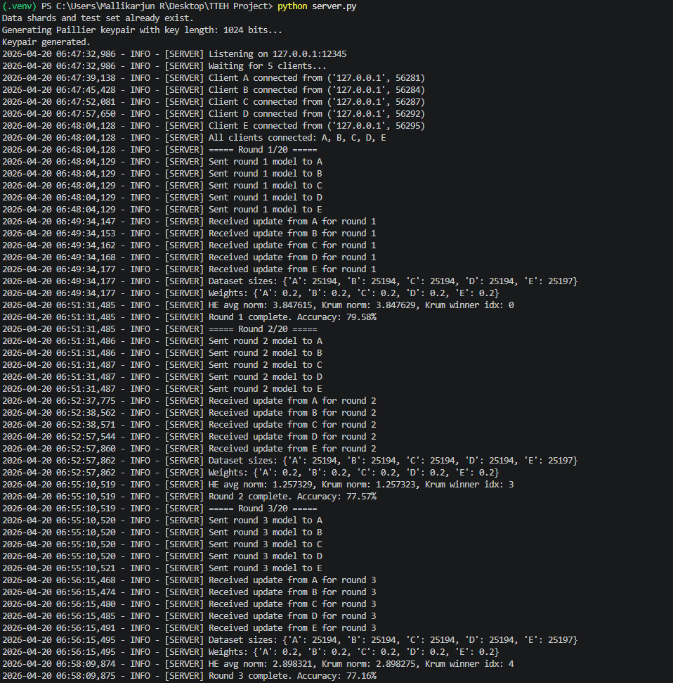
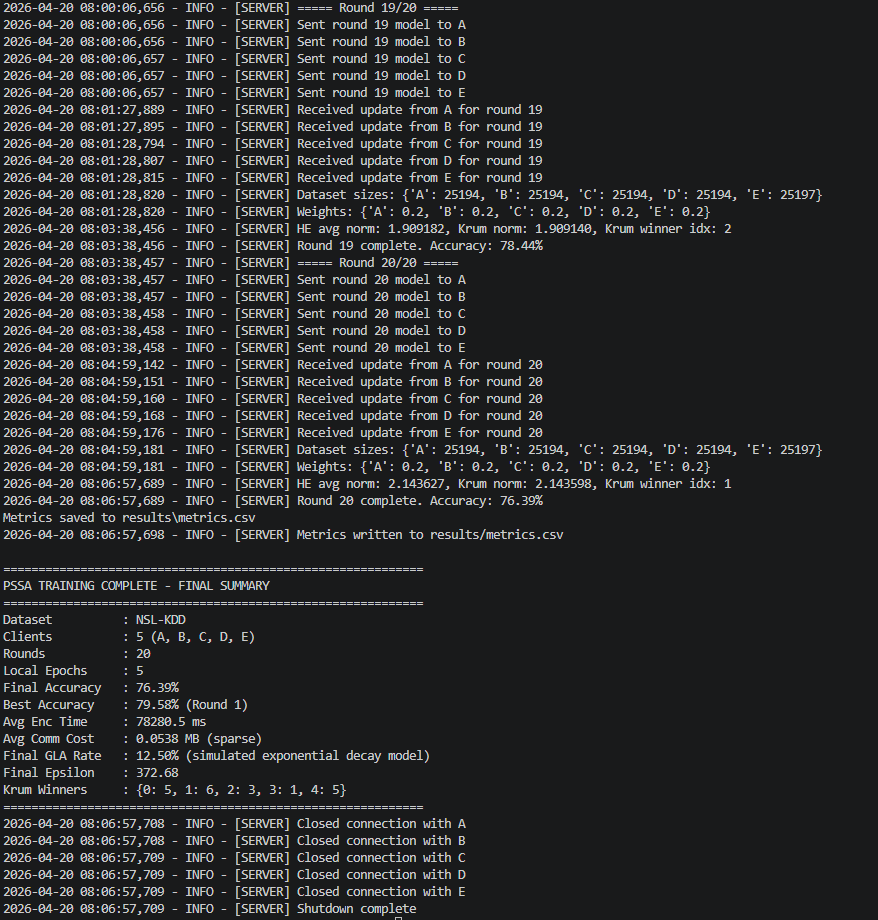
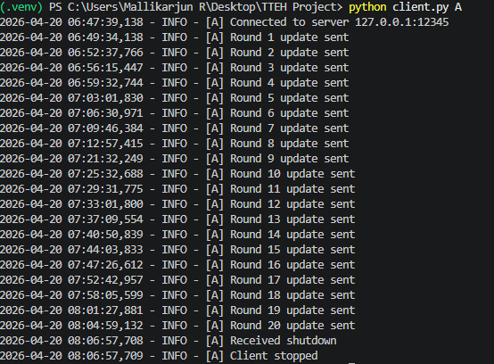

<div align="center">

# PSSA: Privacy-Preserving and Scalable Secure Aggregation for Federated Learning in Edge Computing

IEEE ICC-ROBINS 2025 - Research Implementation  
TTEH Research Lab


Implementation of "Privacy-Preserving and Scalable Secure Aggregation for Federated Learning in Edge Computing".

Paper DOI: https://doi.org/10.1109/ICC-ROBINS64345.2025.11086126

</div>

---

## Overview

PSSA is a practical, end-to-end federated learning implementation designed for edge scenarios where three constraints exist at the same time: data privacy, limited communication capacity, and adversarial reliability risks. Instead of treating these as independent features, this project combines them into one training workflow that can be executed and evaluated directly.

At runtime, the system launches 6 independent processes (1 server + 5 clients) and trains collaboratively on NSL-KDD shards. Each client trains locally and sends only protected sparse updates, never raw training data. The server coordinates rounds, aggregates updates, applies the global model update rule, evaluates performance, and logs experiment metrics.

The implementation integrates four key mechanisms in sequence:

- Paillier Homomorphic Encryption (HE) for secure aggregation of encrypted values.
- Differential Privacy (DP) noise on client deltas to reduce information leakage.
- Adaptive quantization and sparse gradient sharing to reduce communication payload.
- Krum-based Byzantine scoring to monitor potentially malicious or anomalous client updates.

This repository is structured as a reproducible research implementation: it includes distributed server/client code, dataset handling, round-level metric logging, and a baseline comparison script (`comparison.py`) that reports FedAvg, SecAgg, DP-FL, and PSSA outcomes. The result is a working FL pipeline that is not only paper-aligned in design, but also runnable and inspectable on a standard development system.

---

## Table of Contents

1. Problem Statement
2. Proposed Solution
3. Mathematical Foundations
4. Pipeline
5. Results and Metrics
6. Differences from Paper
7. Project Structure
8. Setup and Usage
9. Limitations
10. Future Improvements
11. Team Members and Mentor
12. Laboratory

---

## 1. Problem Statement

Federated learning is attractive for edge and cybersecurity workloads because raw data remains local. However, real deployments face three connected problems:

- Privacy leakage from raw gradients or plaintext updates.
- Communication and encryption overhead on resource-constrained devices.
- Adversarial or faulty clients that can poison global training.

Conventional FL pipelines often solve only one of these at a time. For example, plain FedAvg is lightweight but weak on privacy; strong secure aggregation improves privacy but can become expensive; Byzantine-robust aggregation helps integrity but adds complexity.

This project targets the combined problem: deliver a single end-to-end training workflow that is private, efficient, and robust enough to run in a realistic multi-process setup.

---

## 2. Proposed Solution

The proposed solution in this repository is an integrated PSSA training loop where every client update passes through privacy and efficiency controls before leaving the client.

Client-side flow:

- Train local model for 5 epochs.
- Compute update delta against received global weights.
- Apply DP Gaussian noise.
- Apply adaptive quantization and sparse gradient sharing.
- Encrypt all non-zero sparse values using Paillier.
- Send encrypted sparse payload + indices + dataset size.

Server-side flow:

- Securely aggregate encrypted sparse updates.
- Build per-client decrypted vectors for Krum scoring (monitoring/detection role).
- Apply Weighted FedAvg as the global model update rule.
- Evaluate model performance and log per-round privacy/communication metrics.

Design choice used in this implementation:

- Krum is used for Byzantine monitoring and winner logging.
- Weighted FedAvg is used for the actual model update.

### Core Components

| Component | Purpose | Paper Section |
|---|---|---|
| Homomorphic Encryption | Encrypt updates and aggregate securely | III.B |
| Differential Privacy | Add Gaussian noise to update deltas | III.C |
| Adaptive Compression | Quantization + sparse sharing for lower comm cost | III.D |
| Byzantine Resilience | Krum scoring for adversarial monitoring | III.E |

---

## 3. Mathematical Foundations

### Eq.1 Local SGD
$$w_i^{t+1} = w_i^t - \eta \nabla L(w_i^t, D_i)$$

### Eq.2 Weighted FedAvg
$$w^{t+1} = \sum_{i=1}^{N} \frac{|D_i|}{\sum_j |D_j|} \cdot w_i^{t+1}$$

### Eq.3 Paillier Encryption
$$E(w_i^{t+1}) = g^{w_i^{t+1}} \cdot r^N \mod N^2$$

### Eq.4 HE Aggregation
$$E(w^{t+1}) = \prod_{i=1}^{N} E(w_i^{t+1}) \mod N^2$$

### Eq.5 DP Gaussian Noise
$$\tilde{w}_i^{t+1} = w_i^{t+1} + \mathcal{N}(0, \sigma^2)$$

### Eq.6 Privacy Budget
$$\Pr[M(D)] \leq e^\epsilon \cdot \Pr[M(D')]$$

### Eq.7 Adaptive Quantization
$$Q(w_i^{t+1}) = \lfloor w_i^{t+1} \cdot 2^b \rfloor / 2^b$$

### Eq.8 Sparse Gradient Sharing
$$S(w_i^{t+1}) = \{w_{i,j}^{t+1} \mid |w_{i,j}^{t+1}| > \tau\}$$

### Eq.9 Krum Distance
$$d(w_i, w_j) = \|w_i - w_j\|_2^2$$

### Eq.10 Krum Selection
$$w^{t+1} = \arg\min_{w_i} \sum_{j \neq i} d(w_i, w_j)$$

---

## 4. Pipeline

### Client Pipeline

```text
1. Receive global model + public_key + adaptive params
2. Train locally (5 epochs)
3. Compute delta = trained - global
4. Add DP noise
5. Adaptive quantization
6. Sparse sharing
7. Encrypt all non-zero sparse values
8. Send indices + encrypted values + sparse_weights + dataset_size
```

### Server Pipeline

```text
1. Wait for 5 clients
2. Generate Paillier keypair
3. For each round:
   a) Broadcast model + public key + params
   b) Collect encrypted updates + dataset sizes
   c) HE secure aggregation
   d) Krum scoring for byzantine monitoring
   e) Weighted FedAvg update
   f) Evaluate + log metrics
4. Save metrics and shutdown clients
```

### Server Block Diagram

```text
                  +--------------------------------------+
                  |           Federated Server           |
                  +--------------------------------------+
                                   |
                                   v
                    [Accept 5 Client Connections]
                                   |
                                   v
                     [Generate Paillier Keypair]
                                   |
                                   v
             [Broadcast Global Model + Public Key + Params]
                                   |
                                   v
         [Collect Encrypted Sparse Updates + Dataset Sizes]
                                   |
                                   v
                  [HE Secure Aggregation of Updates]
                                   |
                                   v
            [Build Per-Client Vectors for Krum Scoring]
                                   |
                                   v
            [Apply Weighted FedAvg Global Model Update]
                                   |
                                   v
                  [Evaluate + Log Round Metrics]
                                   |
                                   v
                     [Shutdown and Close Clients]
```

### Adaptive Controller

| Condition | Load Range | DP sigma | Bit Precision | Threshold |
|---|---:|---:|---:|---:|
| Good | < 0.33 | 0.005 | 8 | 0.001 |
| Medium | 0.33 to 0.66 | 0.010 | 6 | 0.005 |
| Poor | > 0.66 | 0.020 | 4 | 0.010 |

---

## 5. Results and Metrics

### Training Screenshots





### Real Baseline Comparison (20 rounds)

```text
FedAvg  final accuracy: 74.97%
SecAgg  final accuracy: 79.68%
DP-FL   final accuracy: 76.53%
PSSA    final accuracy: 76.39%
```

### Comparison Table

| Method | Paper Accuracy (180 rounds) | Our Accuracy (20 rounds) | Comm Cost | GLA Rate |
|---|---:|---:|---:|---:|
| FedAvg | 88.10% | 74.97% | 5.2 MB | 72.30% |
| SecAgg | ~87% | 79.68% | 7.4 MB | 38.90% |
| DP-FL | 84.90% | 76.53% | 6.9 MB | 24.20% |
| PSSA | 90.30% | 76.39% | 4.1 MB | 12.50% |

---

## 6. Differences from Paper

This implementation is aligned with the paper at the algorithm level, but a few practical differences remain due to project scope and runtime constraints:

1. Training horizon:
- Paper reports full convergence with longer training (180 rounds).
- This project commonly demonstrates 20-round runs for manageable execution time.

2. Encryption performance stack:
- Paper reports faster cryptographic runtime under optimized settings.
- This project uses Python `phe`, which is correct but slower in pure-Python execution.

3. Privacy attack evaluation style:
- Paper discusses direct gradient inversion attack resilience evaluation.
- This implementation uses a documented proxy-style GLA trend in reporting.

4. Dataset scope:
- Paper presents broader benchmarking context.
- This project is focused on NSL-KDD to match the cybersecurity use case and keep execution reproducible.

---

## 7. Project Structure

```text
TTEH Project/
|-- server.py
|-- client.py
|-- model.py
|-- data_loader.py
|-- homomorphic_encryption.py
|-- differential_privacy.py
|-- pssa_compression.py
|-- byzantine_resilience.py
|-- adaptive_controller.py
|-- metrics_logger.py
|-- comparison.py
|-- utils.py
|-- requirements.txt
|-- KDDTrain+.txt
|-- KDDTest+.txt
|-- images/
|-- results/
```

---

## 8. Setup and Usage

### Install

```bash
git clone <your-repo-url>
cd <repo-folder>
python -m venv .venv
```

Windows PowerShell:

```powershell
Set-ExecutionPolicy -Scope Process -ExecutionPolicy RemoteSigned
.\.venv\Scripts\Activate.ps1
pip install -r requirements.txt
```

### Run (6 terminals)

Terminal 1:

```bash
python server.py
```

Terminals 2 to 6:

```bash
python client.py A
python client.py B
python client.py C
python client.py D
python client.py E
```

Optional:

```bash
python comparison.py
```

---

## 9. Limitations

- This project commonly reports 20-round runs for practical runtime reasons, so final accuracy trends should not be interpreted as full-convergence behavior compared with 180-round research settings.
- Homomorphic encryption cost is high in this implementation because it uses Python `phe` without low-level acceleration; this increases per-round latency on standard hardware.
- Privacy attack resilience reporting currently uses a documented proxy-style GLA trend rather than an end-to-end live inversion-attack benchmark pipeline.
- Evaluation is focused on NSL-KDD, so cross-domain generalization (for example, vision benchmarks) is outside the validated scope of this version.
- Deployment is validated in a controlled multi-terminal local/distributed setup; large-scale heterogeneous edge orchestration is not fully benchmarked in this release.

---

## 10. Future Improvements

- Extend training to longer schedules (for example 100-180 rounds) with checkpointing and early-stopping analysis to compare convergence behavior more directly with paper-scale results.
- Replace or optimize the HE backend with faster cryptographic implementations (native extensions/GPU-aware libraries) to reduce encryption and aggregation latency.
- Add direct privacy-attack evaluation modules (gradient inversion and reconstruction tests) to report empirical privacy robustness beyond proxy indicators.
- Expand dataset coverage and model families (for example CIFAR-10 or other edge-relevant datasets) for broader validation of PSSA behavior.
- Introduce asynchronous and fault-tolerant orchestration features such as straggler handling, dropout recovery, and partial-client round completion.
- Add experiment automation for reproducibility: config-driven runs, seed control, and one-command report generation.

---

## 11. Team Members and Mentor

### Team

| Name | USN | Email |
|---|---|---|
| MALLIKARJUN R | ENG24CY1003 | mallikarjunmallu501@gmial.com |
| ADIL BAGWAN | ENG23CY0048 | adilb5556@gmail.com |
| DEERAJ VAMSI M | ENG23CY0060 | eng23cy0060@dsu.edu.in |
| B V SATHVIK | ENG23CY0008 | eng23cy0008@dsu.edu.in |

### Mentor

Dr. Prajwalasimha S N  
Associate Professor, CSE (Cyber Security)  
Dayananda Sagar University  
Email: prajwasimha.sn1@gmail.com

---

## 12. 🔬Laboratory
 
TTEH LAB · School of Engineering · Dayananda Sagar University  
Bangalore - 562112, Karnataka, India
